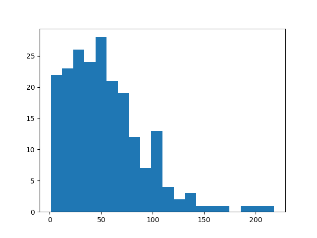

# Dask Parallel Image Segmentation & Preprocessing :
___

A Parallel  segmentation algorithm of a flowers dataset using Dask library on python.

The problem treated is a classic images segmentation problem : through the <code>DaskFlowersSegmentation.py</code> algorithm, I applied some basic preprocessing (grayscale filters as an example), and then implemented a parallel pipeline that preprocess and segment each flower on the dataset.

The final outcome is a histogramm that displays the distribution of the number of segments found in the flowers dataset. This result can be used for further analysis (to identify clusters in the data for example).

This algorithm was implemented as an academic project for the BigData lecture given by <a href="https://github.com/jgratien">Prof.Jean-Marc Gratien</a>.

the data used in this project is from the  <a href="https://www.robots.ox.ac.uk/~vgg/data/flowers/17/index.html">Oxford Flowers</a> dataset.
 
> #### Execution :
___

This ML pipeline can be executed via : <code> python DaskFlowersSegmentation.py</code> 

> #### Requirements :
___
- Python v > 3.6 
- dask

___
___
> #### Author : Benhari Abdessalam
> #### Date : 25/02/2021